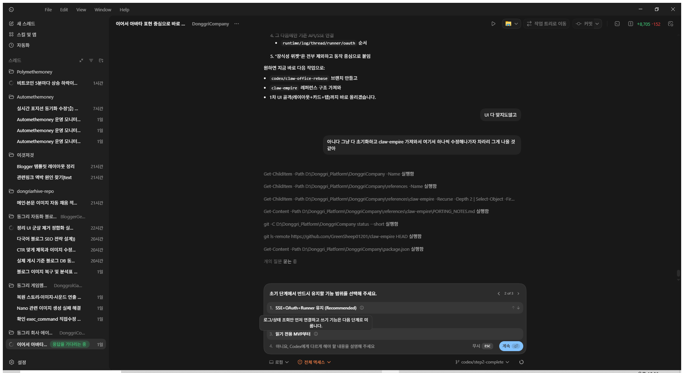
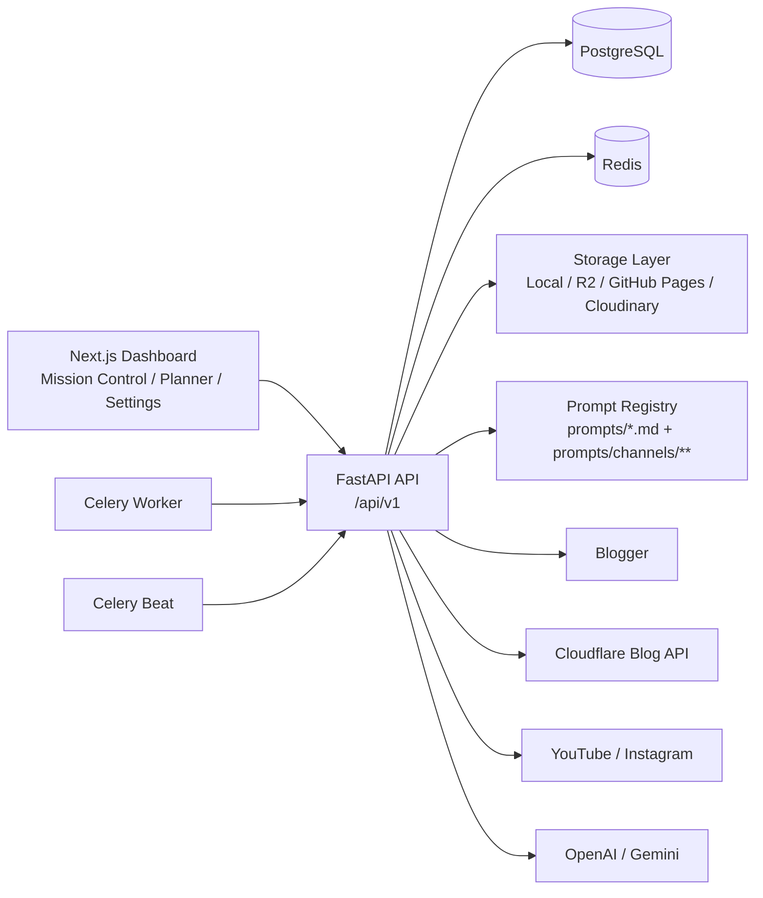

# Bloggent

<p align="center">
  
</p>

<p align="center">
  <strong>동그리 자동 블로그전트</strong><br />
  Blogger, Cloudflare, YouTube, Instagram 운영을 하나의 콘솔에서 연결하는 local-first 콘텐츠 운영 플랫폼
</p>

<p align="center">
  <a href="#빠른-시작">빠른 시작</a> ·
  <a href="#핵심-기능">핵심 기능</a> ·
  <a href="#프롬프트-백업-구조">프롬프트 백업 구조</a> ·
  <a href="#아키텍처">아키텍처</a> ·
  <a href="#운영-명령">운영 명령</a>
</p>

<p align="center">
  
  
  
  
  
  
</p>

## What Is Bloggent?

Bloggent는 콘텐츠 생성만 하는 툴이 아닙니다.<br />
실제 운영 기준으로 필요한 흐름인 `기획 -> 생성 -> 자산 -> 게시 -> 지표 -> 재조정`을 한 화면에 묶은 운영 콘솔입니다.

이 저장소는 아래를 동시에 다룹니다.

- Blogger 장문 포스트 생성과 게시
- Cloudflare 블로그 카테고리별 7단계 자동화
- YouTube / Instagram용 단계별 프롬프트 운영
- Planner 기반 월간 게시 캘린더와 Daily Brief 제안
- SEO / GEO / CTR / 색인 상태 추적
- 설정 UI에서 수정한 프롬프트의 파일 백업 동기화

기본값은 `local-first`, `draft-first`, `mock-safe`입니다.<br />
외부 키 없이도 콘솔과 파이프라인 구조를 먼저 검증할 수 있고, 준비되면 그대로 live 운영으로 전환할 수 있습니다.

## 핵심 기능

### 1. Mission Control 중심 운영

- 생성, 자산, 업로드, 운영 4개 묶음을 기준으로 현재 상태를 한 화면에서 확인
- 연결된 채널 수, 워커 상태, 대기 실행, 실패 실행을 즉시 확인
- Workspace / Runtime / Alerts / Recent Content를 운영 지표로 통합

### 2. Planner Daily Brief

- 월간 캘린더에서 일자별 슬롯 생성
- Daily Brief 분석 결과를 근거로 주제, 대상 독자, 정보 밀도 제안
- 제안을 바로 슬롯에 반영하고 생성 큐로 넘길 수 있음

### 3. 멀티 채널 운영

| 채널 | 현재 구조 | 운영 포인트 |
| --- | --- | --- |
| Blogger | 블로그 이름 기반 폴더 + 실제 프롬프트 파일명 유지 | 장문 글, 이미지 콜라주, SEO 후속 수정 |
| Cloudflare Blog | 채널 -> 카테고리 -> 7단계 파일 구조 | 카테고리별 대량 생성, 고정 7단계 파이프라인 |
| YouTube | 채널 폴더 + 단계별 프롬프트 | 메타데이터, 썸네일, 게시, 성과 리뷰 |
| Instagram | 채널 폴더 + 단계별 프롬프트 | 글/썸네일/릴스 패키징/게시/리뷰 |

### 4. Prompt Flow + 파일 백업 동기화

- 설정 UI에서 단계별 프롬프트를 수정하면 DB와 파일 백업이 동시에 갱신
- `channel.json` 메타와 실제 `.md` 프롬프트 파일을 같이 유지
- backup metadata에서 volatile timestamp를 제거해 git noise를 최소화

### 5. 품질 게이트

- SEO / GEO / CTR 기준치 기반 품질 게이트
- related posts, inline images, publishing trust gate를 서비스 로직에 반영
- 재시도와 차단 원인을 운영 관점에서 식별 가능

## 제품 화면

<p align="center">
  
</p>

## 빠른 시작

기준 환경은 `WSL2 + Docker Desktop + Docker Compose`입니다.

### 1. 저장소 준비

```bash
cd /mnt/d/Donggri_Platform
git clone https://github.com/sheryloe/BloggerGent.git
cd BloggerGent
cp .env.example .env
```

### 2. 최소 환경 변수 설정

아래 값만 먼저 맞추면 `mock mode`로 UI와 기본 파이프라인 구조를 실행할 수 있습니다.

```dotenv
COMPOSE_PROJECT_NAME=bloggent
SERVICE_ENV_FILE=.env
SETTINGS_ENCRYPTION_SECRET=change-this-local-secret
PROVIDER_MODE=mock
DEFAULT_PUBLISH_MODE=draft
PUBLIC_API_BASE_URL=http://localhost:8000
PUBLIC_WEB_BASE_URL=http://localhost:3001
NEXT_PUBLIC_API_BASE_URL=http://localhost:8000/api/v1
WEB_PORT=3001
API_PORT=8000
POSTGRES_PORT=5432
```

### 3. 기본 스택 실행

```bash
cd /mnt/d/Donggri_Platform/BloggerGent
docker compose up -d --build
```

접속 주소:

- Web: [http://localhost:3001/dashboard](http://localhost:3001/dashboard)
- API: [http://localhost:8000/api/v1](http://localhost:8000/api/v1)
- Health: [http://localhost:8000/healthz](http://localhost:8000/healthz)

### 4. 초기 데이터/기본 설정 반영

```bash
cd /mnt/d/Donggri_Platform/BloggerGent
docker compose --profile bootstrap run --rm bootstrap
```

### 5. 비동기 워커까지 함께 실행

게시 큐, 스케줄러, MinIO까지 함께 띄우려면 `full` 프로파일을 사용합니다.

```bash
cd /mnt/d/Donggri_Platform/BloggerGent
docker compose --profile full up -d --build
```

## Live 운영 전환

실제 게시/연동까지 돌리려면 아래 값이 필요합니다.

| 목적 | 필수 변수 |
| --- | --- |
| OpenAI 텍스트/이미지 생성 | `OPENAI_API_KEY` |
| Blogger OAuth | `BLOGGER_CLIENT_ID`, `BLOGGER_CLIENT_SECRET`, `BLOGGER_REDIRECT_URI` |
| Cloudflare 블로그 API | `CLOUDFLARE_BLOG_API_BASE_URL`, `CLOUDFLARE_BLOG_M2M_TOKEN` |
| Instagram OAuth | `INSTAGRAM_CLIENT_ID`, `INSTAGRAM_CLIENT_SECRET`, `INSTAGRAM_REDIRECT_URI` |
| R2 자산 배포 | `CLOUDFLARE_ACCOUNT_ID`, `CLOUDFLARE_R2_BUCKET`, `CLOUDFLARE_R2_ACCESS_KEY_ID`, `CLOUDFLARE_R2_SECRET_ACCESS_KEY` |
| GitHub Pages 자산 배포 | `GITHUB_PAGES_OWNER`, `GITHUB_PAGES_REPO`, `GITHUB_PAGES_BRANCH`, `GITHUB_PAGES_TOKEN` |

실운영에서 권장하는 값:

```dotenv
PROVIDER_MODE=live
DEFAULT_PUBLISH_MODE=draft
SCHEDULE_ENABLED=true
SCHEDULE_TIMEZONE=Asia/Seoul
QUALITY_GATE_ENABLED=true
```

`draft`로 먼저 검증한 뒤 `publish`로 올리는 흐름이 안전합니다.

## 아키텍처



### 서비스 레이어

- `apps/api`: FastAPI, SQLAlchemy, Alembic, Celery
- `apps/web`: Next.js 14 운영 콘솔
- `infra/docker`: API / Web / Postgres / Redis / MinIO 컨테이너 정의
- `prompts`: 글로벌 프롬프트와 채널별 백업 구조
- `docs`: GitHub Pages용 랜딩 및 정적 소개
- `wiki`: 설치, 배포, 보안, 워크플로 문서

## 운영 흐름

### Blogger / 일반 블로그 흐름

1. Topic discovery
2. Article generation
3. Image prompt generation
4. Related posts
5. Image generation
6. HTML assembly
7. Publishing

### Cloudflare Blog 흐름

Cloudflare는 설정 UI 기준으로 항상 7단계를 유지하며, 카테고리마다 별도 백업 폴더를 가집니다.

1. `topic_discovery.md`
2. `article_generation.md`
3. `image_prompt_generation.md`
4. `related_posts.md`
5. `image_generation.md`
6. `html_assembly.md`
7. `publishing.md`

### Platform 채널 흐름

- YouTube: `video_metadata_generation -> thumbnail_generation -> platform_publish -> performance_review`
- Instagram: `article_generation -> thumbnail_generation -> reel_packaging -> platform_publish -> performance_review`

## 프롬프트 백업 구조

이 저장소는 설정 UI에서 바뀐 프롬프트를 파일로도 남깁니다.<br />
즉, 운영 중인 프롬프트를 Git으로 추적하고, 채널별 구조를 실제 서비스 구조처럼 유지합니다.

```text
prompts/
├─ planner_daily_brief_analysis.md
└─ channels/
   ├─ blogger/
   │  ├─ donggri-s-hidden-korea-local-travel-culture/
   │  │  ├─ travel_topic_discovery.md
   │  │  ├─ travel_article_generation.md
   │  │  ├─ travel_collage_prompt.md
   │  │  ├─ travel_inline_collage_prompt.md
   │  │  └─ channel.json
   │  └─ the-midnight-archives/
   │     ├─ mystery_topic_discovery.md
   │     ├─ mystery_article_generation.md
   │     ├─ mystery_collage_prompt.md
   │     ├─ mystery_inline_collage_prompt.md
   │     └─ channel.json
   ├─ cloudflare/
   │  └─ dongri-archive/
   │     ├─ miseuteria-seutori/
   │     │  ├─ topic_discovery.md
   │     │  ├─ article_generation.md
   │     │  ├─ image_prompt_generation.md
   │     │  ├─ related_posts.md
   │     │  ├─ image_generation.md
   │     │  ├─ html_assembly.md
   │     │  └─ publishing.md
   │     ├─ munhwawa-gonggan/
   │     ├─ yeohaenggwa-girog/
   │     └─ channel.json
   ├─ instagram/
   │  └─ instagram-studio/
   │     ├─ article_generation.md
   │     ├─ thumbnail_generation.md
   │     ├─ reel_packaging.md
   │     ├─ platform_publish.md
   │     ├─ performance_review.md
   │     └─ channel.json
   └─ youtube/
      └─ youtube-studio/
         ├─ video_metadata_generation.md
         ├─ thumbnail_generation.md
         ├─ platform_publish.md
         ├─ performance_review.md
         └─ channel.json
```

프롬프트 백업 재동기화:

```bash
cd /mnt/d/Donggri_Platform/BloggerGent
python scripts/sync_channel_prompt_backups.py
```

## 주요 API 표면

| 영역 | 대표 엔드포인트 |
| --- | --- |
| Mission Control | `GET /api/v1/workspace/mission-control` |
| Planner Calendar | `GET /api/v1/planner/calendar` |
| Daily Brief 분석 | `POST /api/v1/planner/days/{plan_day_id}/brief-analysis` |
| Daily Brief 이력 | `GET /api/v1/planner/days/{plan_day_id}/brief-runs` |
| Channel Prompt Flow | `GET /api/v1/channels/{channel_id}/prompt-flow` |
| Channel Prompt 저장 | `PATCH /api/v1/channels/{channel_id}/prompt-flow/steps/{step_id}` |
| Cloudflare Prompt Bundle | `GET /api/v1/cloudflare/prompts` |
| Cloudflare 파일 동기화 | `POST /api/v1/cloudflare/prompts/sync-from-files` |
| Analytics | `GET /api/v1/analytics/integrated` |
| Health | `GET /healthz` |

## 운영 명령

### 로그 확인

```bash
cd /mnt/d/Donggri_Platform/BloggerGent
docker compose logs -f api
docker compose logs -f web
```

워커까지 띄운 경우:

```bash
cd /mnt/d/Donggri_Platform/BloggerGent
docker compose logs -f worker
docker compose logs -f scheduler
```

### 운영 상태 리포트

```bash
cd /mnt/d/Donggri_Platform/BloggerGent
docker compose exec -T api python -m app.tools.ops_health_report
```

### 마이그레이션 적용

```bash
cd /mnt/d/Donggri_Platform/BloggerGent/apps/api
alembic upgrade head
```

### 타입/백엔드 검증

```bash
cd /mnt/d/Donggri_Platform/BloggerGent/apps/web
npm exec -- tsc --noEmit
```

```bash
cd /mnt/d/Donggri_Platform/BloggerGent/apps/api
PYTHONPATH=. pytest tests/test_planner_service.py -q
PYTHONPATH=. pytest tests/test_channel_prompt_service.py -q
PYTHONPATH=. pytest tests/test_blogger_editorial_backfill.py -q
```

## 저장소 구조

```text
apps/
├─ api/                     # FastAPI, SQLAlchemy, Alembic, Celery
│  ├─ app/api/routes/       # REST API surface
│  ├─ app/services/         # business logic
│  ├─ app/tasks/            # scheduler / pipeline
│  ├─ alembic/versions/     # DB migrations
│  └─ tests/                # backend tests
├─ web/                     # Next.js dashboard
prompts/                    # root prompts + channel-aware backups
infra/docker/               # container definitions
docs/                       # GitHub Pages landing
wiki/                       # operator-facing docs
scripts/                    # sync / bootstrap / ops scripts
storage/                    # local generated assets
```

## 문서

- [Getting Started](wiki/Getting-Started.md)
- [Workflow](wiki/Workflow.md)
- [Deployment](wiki/Deployment.md)
- [Security](wiki/Security.md)
- [SEO Metadata](wiki/SEO-Metadata.md)
- [FAQ](wiki/FAQ.md)
- [Service Roadmap](wiki/Service-Roadmap.md)

## 이 저장소를 AI에게 바로 맡길 때

아래 프롬프트를 그대로 붙여 넣으면 됩니다.

```text
이 저장소를 WSL2 + Docker Compose 기준으로 실행해라.

요구사항:
- .env.example을 .env로 복사하고 기본 mock mode로 부팅
- docker compose up -d --build 실행
- /dashboard, /api/v1, /healthz 확인
- 실패하면 원인 파일 수정 후 다시 검증
- 마지막에 변경 파일과 실행 결과를 요약
```

## 현재 포지셔닝

Bloggent는 단순한 콘텐츠 생성기가 아니라 운영 콘솔입니다.<br />
핵심은 "좋은 글을 1개 생성"이 아니라, 여러 채널과 카테고리에서 계속 돌아가는 운영 루프를 안정적으로 관리하는 데 있습니다.

실무 기준으로 필요한 것들:

- 채널별 연결 상태
- 프롬프트 구조와 파일 백업
- 게시 캘린더와 Daily Brief
- 품질 게이트와 차단 이유
- 게시 후 SEO / CTR / 색인 추적

이 저장소는 그 흐름을 하나의 서비스처럼 묶는 데 초점을 둡니다.
